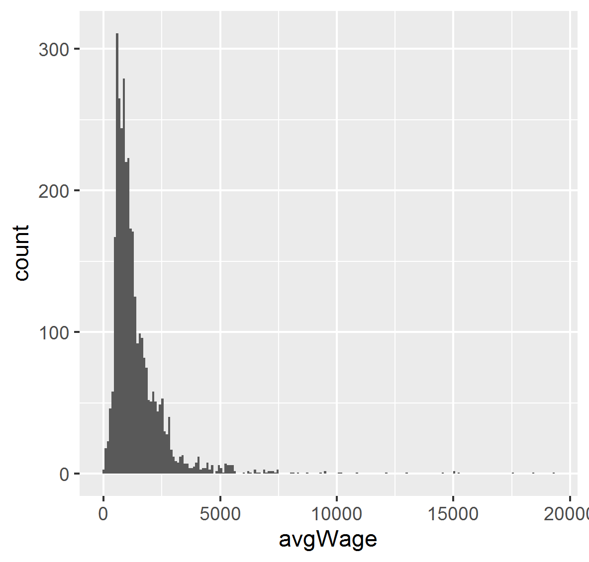
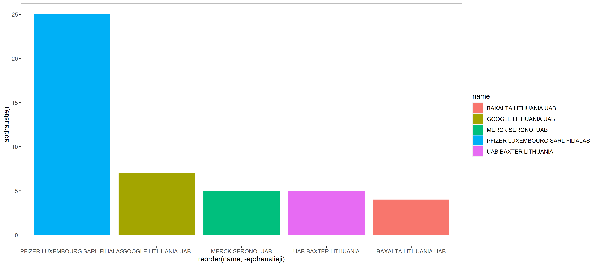

# R Laboratorinis darbas: duomenų vizualizacija

| Variantas | ecoActCode |
|------------- | ------------- |
|1  | 731100 |

### 1. Užduotis

Atsakymas:

Išvados: didžioji dalis įmonių moka darbuotojams ~800 EUR atlyginimą.

### 2. Užduotis

Atsakymas:

Išvados: metų eigoje matome didelius periodinius atlyginimų svyravimus. galbūt darbuotojams tam tikrą mėnesį yra išmokamos premijos.

### 3. Užduotis

Atsakymas:

Išvados: didžiausias apdraustųjų skaičius yra įmonėje Pfizer Luxemburg Sarl.

### 4. Užduotis

Shiny R aplikacijos nuotrauka:

